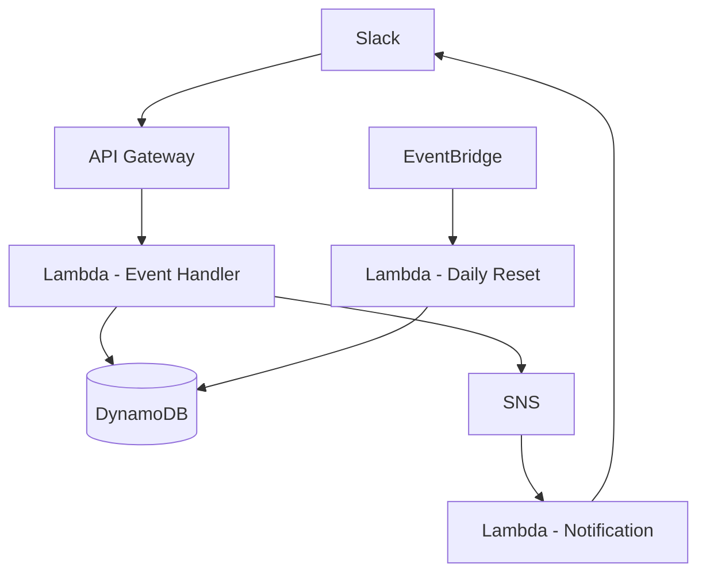
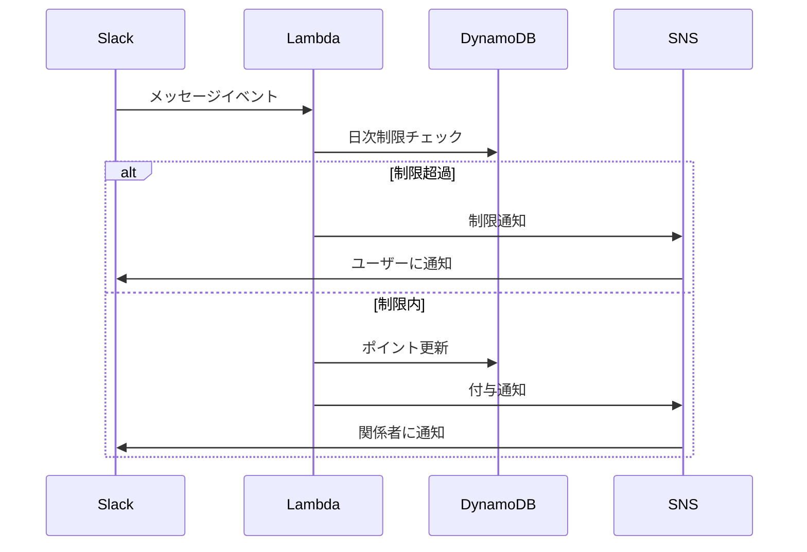

# Slack感謝ポイントシステム 詳細設計書

## 1. システム概要

### 1.1 目的
- Slack上で感謝の気持ちを可視化し、チーム内のポジティブなコミュニケーションを促進する
- 感謝の言葉とポイントを通じて、チームメンバー間の貢献を認識・評価できる仕組みを提供する

### 1.2 主要機能
1. ポイント付与機能
   - メンション付きの「ありがとう」メッセージによるポイント付与
   - 1日あたりの付与制限（5ポイント/人）管理
   - 複数人同時メンション対応
   - 制限超過時の通知機能

2. ポイント管理機能
   - 受領ポイント履歴の確認
   - 感謝メッセージ履歴の確認
   - 個人別ポイント集計

## 2. システムアーキテクチャ

### 2.1 AWSコンポーネント構成



### 2.2 使用するAWSサービス
- **API Gateway**: Slackからのイベントを受け付ける
- **Lambda**: 
  - Event Handler: メインロジック処理
  - Notification: 通知処理
  - Daily Reset: 日次ポイントリセット
- **DynamoDB**: データ永続化
- **SNS**: 非同期通知処理
- **EventBridge**: 定期実行スケジューリング

## 3. データモデル

### 3.1 DynamoDBテーブル設計

#### Users Table
```
{
    "user_id": String (PK),
    "total_points": Number,
    "daily_points_given": Number,
    "last_reset_date": String,
    "received_messages": [
        {
            "message_id": String,
            "from_user": String,
            "message": String,
            "points": Number,
            "timestamp": String
        }
    ]
}
```

#### Transaction Table
```
{
    "transaction_id": String (PK),
    "from_user": String,
    "to_users": [String],
    "message": String,
    "points": Number,
    "timestamp": String
}
```

## 4. クラス設計

### 4.1 主要クラス
```typescript
// ポイント管理クラス
class PointManager {
    async addPoints(fromUser: string, toUsers: string[], message: string): Promise<Result>
    async checkDailyLimit(userId: string): Promise<boolean>
    async resetDailyPoints(): Promise<void>
    async getPointsHistory(userId: string): Promise<PointHistory>
}

// メッセージ処理クラス
class MessageProcessor {
    async processMessage(message: SlackMessage): Promise<void>
    private extractMentions(message: string): string[]
    private validateMessage(message: string): boolean
}

// 通知管理クラス
class NotificationManager {
    async sendLimitExceededNotification(userId: string): Promise<void>
    async sendPointsAddedNotification(toUsers: string[]): Promise<void>
}

// データアクセスクラス
class DataAccess {
    async updateUserPoints(userId: string, points: number): Promise<void>
    async getUserData(userId: string): Promise<UserData>
    async saveTransaction(transaction: Transaction): Promise<void>
}
```

## 5. 処理フロー

### 5.1 ポイント付与フロー


## 6. セキュリティ設定

### 6.1 IAM権限設定
- Lambda実行ロール
  - DynamoDB読み書き権限
  - SNS発行権限
- API Gateway
  - Lambda呼び出し権限
  - WAF連携

### 6.2 暗号化設定
- DynamoDBテーブル暗号化: AWS KMS
- API Gateway: TLS 1.2
- SNSトピック: サーバーサイド暗号化

## 7. 監視・ログ設定

### 7.1 CloudWatch設定
- メトリクス監視
  - API Gatewayリクエスト数
  - Lambda実行時間
  - DynamoDBスロットリング
- ログ
  - Lambda実行ログ
  - API Gatewayアクセスログ

### 7.2 アラート設定
- エラー率閾値超過
- API Latency異常
- DynamoDBキャパシティ超過

## 8. 非機能要件

### 8.1 パフォーマンス要件
- API レスポンスタイム: 1秒以内
- 同時リクエスト処理: 100req/sec

### 8.2 可用性要件
- サービス稼働率: 99.9%
- バックアップ: 日次
- リージョン: ap-northeast-1（東京）

### 8.3 スケーラビリティ
- DynamoDB: オンデマンドキャパシティ
- Lambda: 同時実行数制限 - 100
